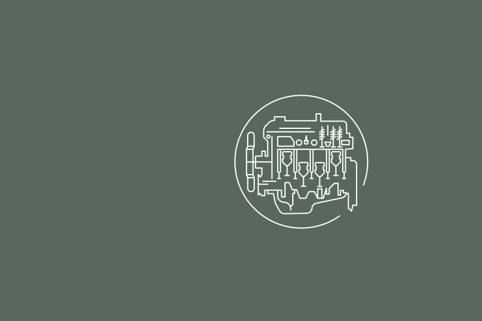

## Mesin yang sama

**Bacaan pekan ini:** Efesus 2:19–3:7

Ketika seorang ayah dan putranya sedang dalam perjalanan pulang, sang anak mengamati mobil-mobil yang mereka lewati, mencari yang sama dengan mobil ayahnya. Tiba-tiba sang ayah menunjuk sebuah mobil dan berseru, “Itu sama dengan mobil pertama Ayah!” Sesampainya di rumah, sang ayah mengeluarkan buku petunjuk mobil pertamanya dan buku petunjuk mobil yang sekarang. Dengan saksama ia menunjukkan ciri-ciri masing-masing kendaraan kepada putranya, menjelaskan bagian yang serupa dan yang telah berubah. Ketika mereka membandingkan kedua mesinnya, semuanya sama persis. Banyak hal telah berubah, tetapi mesinnya tetap sama.

Allah berbicara melalui para nabi dalam Perjanjian Lama maupun Perjanjian Baru. Kesinambungan dan keselarasan antara kedua perjanjian itu ada karena Roh Kudus—Sumber, atau “Mesin,” dari ilham ilahi—tetap sama. Roh Kudus senantiasa memperlengkapi nabi-nabi sejati melalui karunia nubuat.

Ia juga menempatkan Kristus sebagai pusat pekabaran para nabi, sebagaimana dijelaskan dalam kitab Ibrani (Ibr. 1:1–3).

Salah satu hal penting yang muncul ketika membaca Perjanjian Baru ialah memahami perbedaan dan persamaan antara nabi dan rasul. Para nabi Perjanjian Baru melanjutkan banyak tugas yang sama dengan para nabi Perjanjian Lama, yang sudah cukup kita kenal. Namun, kata “rasul” merupakan istilah Perjanjian Baru yang pertama kali diperkenalkan dalam kitab-kitab Injil. Jadi, apa yang menjadikan seseorang rasul?

Para rasul adalah “utusan,” atau “orang yang diutus” Allah, sebagaimana arti kata Yunani apostolos. Dalam keempat kitab Injil, kata “rasul” merujuk pada kedua belas murid. Bagian lain Perjanjian Baru mendukung pengertian ini sekaligus memperluasnya dengan memasukkan pemimpin-pemimpin gereja lain yang tidak termasuk kedua belas murid pertama Kristus.

Paulus menyebut dirinya rasul sebanyak dua belas kali dalam surat-suratnya.

Dalam Roma 1:1, 2, ia menghubungkan panggilan kerasulannya dan isi pemberitaannya dengan pekabaran para nabi Perjanjian Lama. Ia memperkenalkan dirinya sebagai rasul bagi bangsa-bangsa bukan Yahudi (Rm. 11:13).

Paulus diangkat “oleh kehendak Allah” (1 Kor. 1:1). Berbeda dengan keimaman yang diwariskan dari ayah kepada anak dalam garis keluarga, Allah mengangkat nabi dan rasul menurut kehendak-Nya. Ketika kerasulan Paulus dipersoalkan, ia membela panggilannya (1 Kor. 9:1, 2). Paulus memandang kerasulannya sebagai pekerjaan yang dibangun di atas karya Kristus, Dasar gereja (Ef. 2:20). Sebagai penerima penyataan Allah, para rasul memiliki tingkat ilham yang sama dengan para nabi (Ef. 3:1–5).

Dalam 2 Petrus 3:1, 2, Petrus berbicara tentang para nabi sebagai orang-orang yang datang sebelumnya dan yang perkataannya penting, kemudian menampilkan para rasul sebagai pembawa wewenang yang sama. Ayat-ayat ini merujuk pada zaman Perjanjian Lama maupun Perjanjian Baru. Meskipun para nabi mungkin tampak sebagai utusan Allah pada zaman Perjanjian Lama dan para rasul sebagai utusan-Nya pada zaman Perjanjian Baru, ada orang-orang yang bernubuat atau menggunakan karunia nubuat tetapi bukan rasul.

Dengan kata lain, karunia nubuat pada zaman Perjanjian Baru tidak terbatas pada para rasul, dan tidak semua nabi adalah rasul (Kis. 15:32).

Tanpa karunia nubuat yang diberikan kepada para rasul dan nabi-nabi lainnya, tidak akan ada kisah gereja mula-mula yang membawa Injil kepada dunia. Hanya melalui kuasa dan tuntunan Roh Kudus gereja dapat menunaikan misinya. Melalui mimpi dan penyataan, Allah memberitahukan kepada utusan-utusan-Nya ke mana mereka harus pergi (Kis. 10:1–23; 16:6–10). Diilhami Roh Kudus, para nabi mengingat perkataan Yesus dan menuliskan kisah Injil agar dibaca seluruh dunia (Yoh. 14:26). Roh Kudus mengajarkan kebenaran-kebenaran penting dan menyatakan masa depan kepada mereka (Yoh. 16:13; Why. 1:1–3).

Ketika membaca Perjanjian Baru, kita melihat bahwa Yesus menjadi pusat hampir semua yang mereka tulis. Dengan berbagai cara, kehidupan, kematian, kebangkitan, pelayanan-Nya sebagai Imam Besar, dan kedatangan-Nya kedua kali menjadi perhatian utama mereka.

Pekan ini, kita akan menelaah karunia nubuat dalam Perjanjian Baru: apa yang dilakukan para nabi, siapa yang menjalankan peran sebagai nabi, persamaan dan perbedaan nabi dengan rasul, serta bahaya nabi-nabi palsu.

Ketika berbicara kepada para nelayan, Ia memakai bahasa penangkapan ikan untuk menyampaikan kebenaran. Ketika berada di tengah alam, Ia menarik pelajaran dari lingkungan alam di sekitar-Nya.

### inScribe

Buatlah kerangka atau peta pikiran dari Efesus 2:19–3:7. Carilah apa yang dinyatakan tentang peran para nabi dalam gereja mula-mula.

Lingkari kata, frasa, atau gagasan yang berulang.

Garisbawahi kata atau frasa yang penting dan bermakna bagi Anda.

Gambarlah tanda panah untuk menghubungkan kata atau frasa dengan kata atau frasa lain yang berkaitan.

Secara keseluruhan, pemahaman khusus apa yang ditunjukkan oleh tanda-tanda yang Anda buat?
